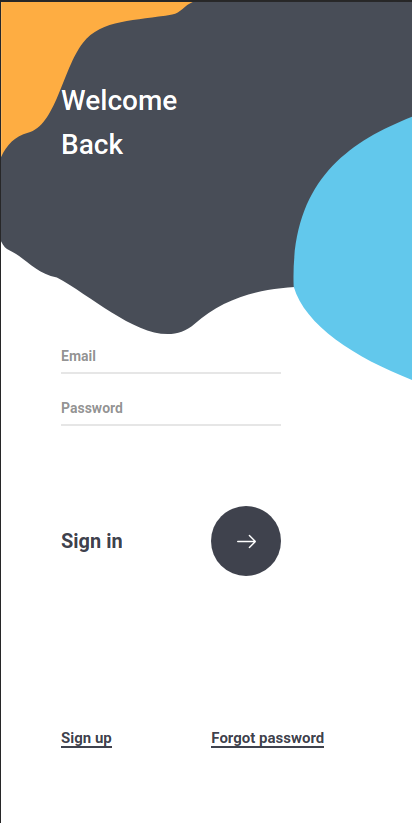
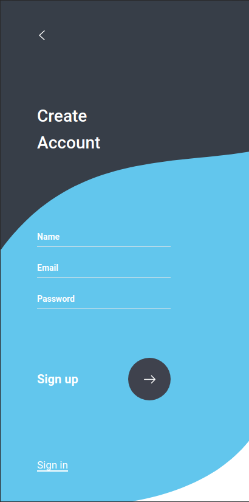

<h1>Sign in|Sign up SVG</h1>

</img>
</img>

# Sobre o projeto
Projeto simples para treinar uso de svgs e css no geral.

Eu mesmo criei os svgs com o <a href="https://inkscape.org/">Inkspace</a>
Também estou usando <a href="https://animejs.com/">Animejs</a> para criar as animações ( Descobri essa lib recentemente, e estou testando. Mas as animações são simples, sem necessidade de usar libs. )

O design, entretanto, não é meu. Link para a página no Dribbble: <a href="https://dribbble.com/shots/6371155-Sign-in-Sign-up-UI">link</a>

# Rodando o projeto
Simples html/css/js. Baixe os arquivos, e abra **index.html**.